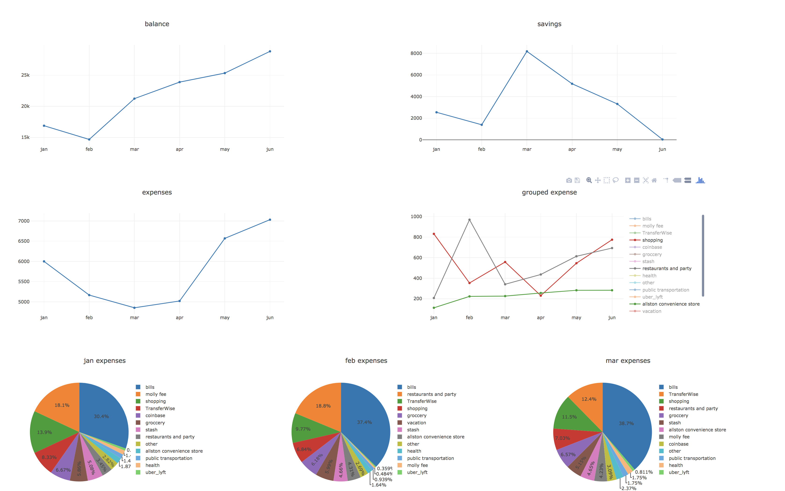

To run, clone the repo and add a data.js file. Data.js should have the following content:
```
var data = `<csv data of bank statement>`;
```
Note the backtick quotes used for multi line string. Also, data should not have any empty lines or the column headings.

You can add groups in main.js by adding them to `var groups`.

## TODO:
* React native
* Plaid Integration
* ~~Refactor to use ES6 modules~~
* Dynamically add groups
* Login

## Screenshots


## Common Issues
If you get the cors exception on your web console (on Mac), just navigate to the directory you want to use and enter the following command:
`python -m SimpleHTTPServer 8000`
or
```
sudo npm install http-server -g
http-server -p 8000
```
on windows you will need to setup a webserver or turn off the CORS security on your chrome application